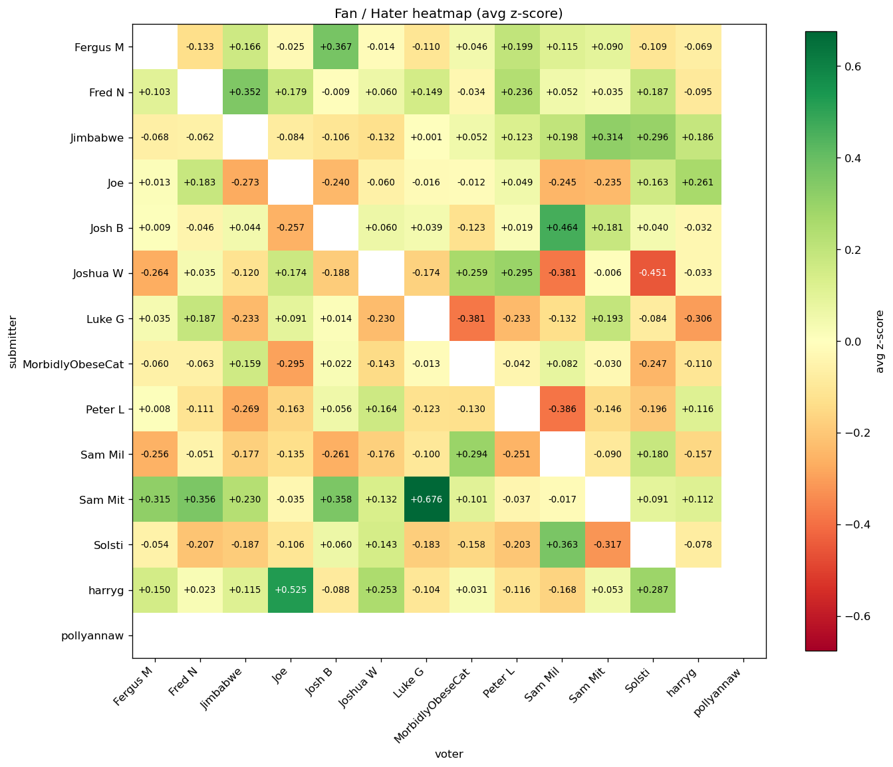

# Music League analysis

## Overview

| metric              |   value |
|---------------------|---------|
| Leagues             |       5 |
| Rounds              |      43 |
| Songs submitted     |     520 |
| Distinct submitters |      14 |
| Distinct voters     |      14 |

## Player Ranking

_Players with at least 2 songs submitted, ranked by mean within-round z-score (score normalised against the other songs in the same round). avg_z > 0 means the player typically beats the round average; total_score is the raw points sum._

|   rank | player           |   avg_z |   total_z |   total_score |   songs |
|--------|------------------|---------|-----------|---------------|---------|
|      1 | Sam Mit          |    0.39 |     16.1  |           226 |      41 |
|      2 | Jimbabwe         |    0.19 |      6.28 |           179 |      33 |
|      3 | harryg           |    0.18 |      7.91 |           197 |      43 |
|      4 | Fred N           |    0.17 |      7.12 |           192 |      43 |
|      5 | Josh B           |    0.12 |      4.14 |           131 |      35 |
|      6 | Fergus M         |    0.11 |      4.56 |           169 |      43 |
|      7 | pollyannaw       |    0.05 |      0.88 |            82 |      18 |
|      8 | Joe              |   -0.04 |     -1.23 |           107 |      33 |
|      9 | Luke G           |   -0.08 |     -2.86 |           125 |      38 |
|     10 | Joshua W         |   -0.16 |     -6.4  |           121 |      41 |
|     11 | Peter L          |   -0.21 |     -7.7  |           138 |      37 |
|     12 | Solsti           |   -0.23 |     -7.28 |           106 |      31 |
|     13 | MorbidlyObeseCat |   -0.24 |    -10.3  |           142 |      43 |
|     14 | Sam Mil          |   -0.27 |    -11.1  |           131 |      41 |

## League Winners

_Player with the highest total score in each league._

| league               | player   |   total |   songs |
|----------------------|----------|---------|---------|
| Basic League         | Joe      |      31 |       8 |
| Jamie is a soft boy  | Sam Mit  |     101 |      13 |
| Montage League       | Josh B   |      34 |       8 |
| Show me what you got | Fred N   |      75 |      10 |
| Song for the Season  | Fred N   |      19 |       4 |

## Medal Ranking

_Olympic-style: 3 points for finishing 1st in a round, 2 for 2nd, 1 for 3rd. Ties share the higher rank, so two songs tied for 1st both earn 3 medal points._

|   rank | player           |   gold 🥇 |   silver 🥈 |   bronze 🥉 |   medal_points |
|--------|------------------|----------|------------|------------|----------------|
|      1 | Sam Mit          |       10 |          5 |          5 |             45 |
|      2 | harryg           |        6 |          7 |          5 |             37 |
|      3 | Fred N           |        6 |          5 |          5 |             33 |
|      4 | Fergus M         |        6 |          5 |          4 |             32 |
|      5 | Joe              |        5 |          2 |          2 |             21 |
|      6 | Joshua W         |        5 |          0 |          5 |             20 |
|      7 | Jimbabwe         |        3 |          3 |          5 |             20 |
|      8 | Josh B           |        2 |          4 |          5 |             19 |
|      9 | Luke G           |        1 |          7 |          2 |             19 |
|     10 | Sam Mil          |        2 |          4 |          4 |             18 |
|     11 | MorbidlyObeseCat |        2 |          4 |          4 |             18 |
|     12 | Peter L          |        1 |          3 |          4 |             13 |
|     13 | Solsti           |        2 |          2 |          2 |             12 |
|     14 | pollyannaw       |        3 |          0 |          1 |             10 |

## Biggest Fans

_For each submitter, the voter whose votes land furthest from that voter's own per-round vote distribution. Metric: mean z-score across shared rounds, where z = (vote - voter_round_mean) / voter_round_std and unrated songs in a participated round count as 0. Rounds where the voter gave every song the same vote are dropped (z is undefined). pts is the raw cumulative points for context. See the 'Fan / Hater Heatmap' for the full pair-by-pair view._

|   rank | player           | biggest_fan      |   fan_z |   pts |   shared_rounds |
|--------|------------------|------------------|---------|-------|-----------------|
|      1 | pollyannaw       | harryg           |    0.87 |    16 |              18 |
|      2 | Sam Mit          | Luke G           |    0.54 |    30 |              36 |
|      3 | harryg           | Joe              |    0.54 |    21 |              33 |
|      4 | Josh B           | Sam Mil          |    0.52 |    24 |              34 |
|      5 | Fergus M         | Josh B           |    0.49 |    23 |              34 |
|      6 | Joe              | harryg           |    0.45 |    20 |              33 |
|      7 | Solsti           | Sam Mil          |    0.41 |    22 |              31 |
|      8 | Luke G           | Sam Mit          |    0.38 |    20 |              36 |
|      9 | Fred N           | Jimbabwe         |    0.35 |    26 |              33 |
|     10 | Jimbabwe         | Sam Mit          |    0.31 |    22 |              33 |
|     11 | Sam Mil          | MorbidlyObeseCat |    0.29 |    23 |              40 |
|     12 | Joshua W         | pollyannaw       |    0.26 |     9 |              16 |
|     13 | MorbidlyObeseCat | pollyannaw       |    0.21 |     9 |              18 |
|     14 | Peter L          | harryg           |    0.21 |    21 |              37 |

## Biggest Haters

_For each submitter, the voter whose votes land furthest from that voter's own per-round vote distribution. Metric: mean z-score across shared rounds, where z = (vote - voter_round_mean) / voter_round_std and unrated songs in a participated round count as 0. Rounds where the voter gave every song the same vote are dropped (z is undefined). pts is the raw cumulative points for context. See the 'Fan / Hater Heatmap' for the full pair-by-pair view._

|   rank | player           | biggest_hater    |   hater_z |   pts |   shared_rounds |
|--------|------------------|------------------|-----------|-------|-----------------|
|      1 | Joe              | pollyannaw       |     -0.52 |     0 |               8 |
|      2 | Joshua W         | Sam Mil          |     -0.47 |     0 |              36 |
|      3 | Sam Mit          | pollyannaw       |     -0.47 |     2 |              18 |
|      4 | Fred N           | pollyannaw       |     -0.46 |     2 |              18 |
|      5 | MorbidlyObeseCat | Joe              |     -0.44 |     1 |              33 |
|      6 | pollyannaw       | Fred N           |     -0.42 |     3 |              18 |
|      7 | Peter L          | Sam Mil          |     -0.34 |     4 |              36 |
|      8 | Luke G           | harryg           |     -0.32 |     4 |              38 |
|      9 | Solsti           | MorbidlyObeseCat |     -0.27 |     6 |              31 |
|     10 | Sam Mil          | Josh B           |     -0.22 |     6 |              34 |
|     11 | Josh B           | Joe              |     -0.21 |     3 |              29 |
|     12 | Fergus M         | Solsti           |     -0.19 |     6 |              31 |
|     13 | harryg           | Josh B           |     -0.17 |     6 |              34 |
|     14 | Jimbabwe         | Joshua W         |     -0.13 |     8 |              31 |

## Fan / Hater Heatmap

_Mean z-score per (submitter row, voter column) pair. Green = the voter tends to give that submitter higher-than-average votes (fan); red = lower-than-average (hater). Diagonal blank: nobody votes on their own song. Names alphabetised on both axes._

## Over Performers

_Top 10 songs ranked by how many standard deviations above the round average they scored — a 10 in a round averaging 4 outranks a 10 in a round averaging 8._

|   rank |   z_in_round |   score |   round_avg | song                      | artist         | player     | league               | round             |
|--------|--------------|---------|-------------|---------------------------|----------------|------------|----------------------|-------------------|
|      1 |         2.25 |      14 |           6 | Hurt                      | Johnny Cash    | Sam Mil    | Show me what you got | Covers            |
|      2 |         2.24 |      14 |           6 | Night On My Mind          | Sharky         | Jimbabwe   | Show me what you got | Awesome Obscurity |
|      3 |         2.24 |      15 |           4 | 19-2000 - Soulchild Remix | Gorillaz       | Sam Mit    | Jamie is a soft boy  | Best Remix        |
|      4 |         2.21 |       7 |           3 | Learn to Fly              | Foo Fighters   | Josh B     | Montage League       | Family time       |
|      5 |         2.19 |      14 |           6 | Hit the Road Jack         | Ray Charles    | Luke G     | Show me what you got | Shorties          |
|      6 |         2.12 |       6 |           3 | Fat Lip                   | Sum 41         | Josh B     | Montage League       | Pre-drinks        |
|      7 |         2.1  |       7 |           3 | Kiss and Run              | Quiet Houses   | Fergus M   | Basic League         | Verb              |
|      8 |         2.08 |      12 |           6 | Jolene                    | Dolly Parton   | Fergus M   | Show me what you got | Name Check        |
|      9 |         2.07 |      13 |           4 | Free Bird                 | Lynyrd Skynyrd | Fergus M   | Jamie is a soft boy  | From the grave    |
|     10 |         2.07 |       8 |           3 | Von dutch                 | Charli xcx     | pollyannaw | Montage League       | At the gym        |

## Under Performers

_Top 10 songs ranked by how many standard deviations below the round average they scored. The score column is still the raw points; round_avg is the mean across all songs in that round._

|   rank |   z_in_round |   score |   round_avg | song                                         | artist           | player   | league              | round                                   |
|--------|--------------|---------|-------------|----------------------------------------------|------------------|----------|---------------------|-----------------------------------------|
|      1 |        -2.82 |     -12 |        4    | Guitar Pick                                  | MEMI             | Joshua W | Jamie is a soft boy | Dirty foreigners                        |
|      2 |        -2.25 |      -4 |        2.09 | Your Heart Is a Muscle the Size of Your Fist | Ramshackle Glory | Fred N   | Basic League        | Body Part                               |
|      3 |        -2.17 |      -1 |        3    | Sheila                                       | Jamie T          | harryg   | Basic League        | Jamie’s round                           |
|      4 |        -2.12 |       0 |        3    | Cigaro                                       | System Of A Down | Sam Mil  | Montage League      | Pre-drinks                              |
|      5 |        -2.1  |     -10 |        4    | Hands Open                                   | Snow Patrol      | Luke G   | Jamie is a soft boy | Song from a video game soundtrack.      |
|      6 |        -2.09 |      -9 |        4    | Into the West                                | Annie Lennox     | Fergus M | Jamie is a soft boy | Worst (Best) songs to play at a funeral |
|      7 |        -2.04 |      -5 |        4    | 21 Seconds                                   | So Solid Crew    | Josh B   | Jamie is a soft boy | Bow Chicka Wow Wow                      |
|      8 |        -1.85 |      -5 |        4    | Angel Of Death                               | Slayer           | Luke G   | Jamie is a soft boy | Freebird!                               |
|      9 |        -1.81 |      -4 |        4    | Nutshell                                     | Alice In Chains  | Joe      | Jamie is a soft boy | You lot are fucking old                 |
|     10 |        -1.81 |      -4 |        4    | Saturday Night                               | Whigfield        | Luke G   | Jamie is a soft boy | You lot are fucking old                 |

## Polarising Songs

_Top 10 songs that genuinely split the room. Metric: per song, the std of its explicit (non-zero) votes, z-scored against the other songs' stds in the same round. Songs need at least 4 explicit raters AND at least one positive AND at least one negative vote — a standout +N alone is a consensus winner, not polarisation. Leagues without downvotes are excluded by construction (no way to express dislike). total_up / total_down are the sums of positive / |negative| points; up_votes / down_votes are the head-counts._

|   rank |    z |   score |   total_up |   total_down |   up_votes |   down_votes | song                                     | artist            | player           | league              | round                                   |
|--------|------|---------|------------|--------------|------------|--------------|------------------------------------------|-------------------|------------------|---------------------|-----------------------------------------|
|      1 | 2.41 |      -4 |          5 |            9 |          3 |            6 | Saturday Night                           | Whigfield         | Luke G           | Jamie is a soft boy | You lot are fucking old                 |
|      2 | 2.25 |       0 |          5 |            5 |          2 |            4 | Cha-Ching (Till We Grow Older)           | Imagine Dragons   | Fergus M         | Jamie is a soft boy | Deep Cuts                               |
|      3 | 2.16 |      -1 |          6 |            7 |          4 |            4 | Instant Crush (feat. Julian Casablancas) | Daft Punk         | Jimbabwe         | Jamie is a soft boy | Freebird!                               |
|      4 | 2.03 |       4 |         10 |            6 |          5 |            5 | Hayloft                                  | Mother Mother     | Fred N           | Jamie is a soft boy | A family affair                         |
|      5 | 1.91 |       3 |          5 |            2 |          2 |            2 | Faith - Remastered                       | George Michael    | Fred N           | Jamie is a soft boy | From the grave                          |
|      6 | 1.88 |       7 |         10 |            3 |          6 |            2 | Good Riddance (Time of Your Life)        | Green Day         | Peter L          | Jamie is a soft boy | Worst (Best) songs to play at a funeral |
|      7 | 1.72 |       2 |          5 |            3 |          4 |            3 | PROJECT: Yi                              | League of Legends | MorbidlyObeseCat | Basic League        | Jamie’s round                           |
|      8 | 1.71 |       5 |          7 |            2 |          4 |            2 | Black Lungs                              | Architects        | harryg           | Basic League        | Colour                                  |
|      9 | 1.68 |       8 |          9 |            1 |          4 |            1 | Ni**as In Paris                          | JAŸ-Z             | Josh B           | Jamie is a soft boy | He did what?                            |
|     10 | 1.66 |       0 |          4 |            4 |          3 |            3 | Sexy And I Know It                       | LMFAO             | Sam Mil          | Jamie is a soft boy | Bow Chicka Wow Wow                      |

## Most Played Artists

_Top 10 artists by number of songs submitted across all rounds._

|   rank | artist           |   plays |   total_score |   avg_score |
|--------|------------------|---------|---------------|-------------|
|      1 | The Wombats      |      12 |            25 |        2.08 |
|      2 | Green Day        |       5 |            27 |        5.4  |
|      3 | System Of A Down |       5 |            17 |        3.4  |
|      4 | Queen            |       3 |            27 |        9    |
|      5 | Gorillaz         |       3 |            26 |        8.67 |
|      6 | Fall Out Boy     |       3 |            20 |        6.67 |
|      7 | The Offspring    |       3 |            19 |        6.33 |
|      8 | Kid Kapichi      |       3 |            18 |        6    |
|      9 | Muse             |       3 |            17 |        5.67 |
|     10 | Good Charlotte   |       3 |            16 |        5.33 |

## Repeats

_Tracks (matched by Spotify track ID) submitted in more than one round, either by the same player or by different players._

|   rank |   plays | song                    | artist                       | players                      |   total_score |
|--------|---------|-------------------------|------------------------------|------------------------------|---------------|
|      1 |       2 | Snacky In My Packy      | Gabby's Dollhouse            | Fred N, harryg               |            12 |
|      2 |       2 | Supermassive Black Hole | Muse                         | Joshua W, pollyannaw         |            10 |
|      3 |       2 | back to friends         | sombr                        | MorbidlyObeseCat, pollyannaw |            10 |
|      4 |       2 | Invaders Must Die       | The Prodigy                  | Sam Mit                      |             6 |
|      5 |       2 | Turn                    | The Wombats                  | Sam Mil                      |             4 |
|      6 |       2 | Heat Waves              | Glass Animals                | Sam Mil, Solsti              |             1 |
|      7 |       2 | Get Low                 | Lil Jon & The East Side Boyz | Josh B, Solsti               |             0 |

## Forfeits

_Points lost on a player's songs when voters in that round failed to cast a ballot. Music League discards votes given by anyone who missed the voting deadline._

|   rank | player           |   songs_with_forfeit |   total_forfeit_points |
|--------|------------------|----------------------|------------------------|
|      1 | MorbidlyObeseCat |                    1 |                     -3 |
|      2 | Sam Mil          |                    2 |                     -5 |
|      3 | Fergus M         |                    2 |                     -6 |
|      4 | Josh B           |                    1 |                     -7 |
